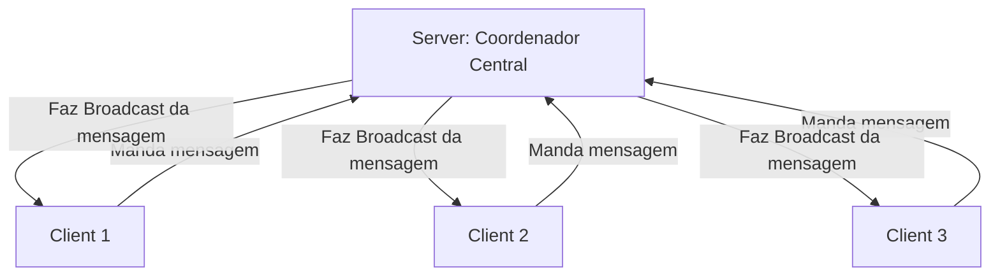
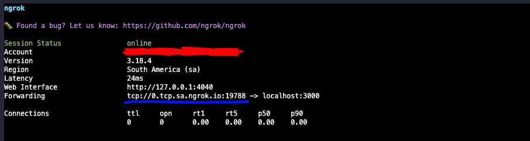

# **Trabalho Arquitetura de Sistemas Distribuídos**

## **Tema:** 
**Construção de uma Aplicação com Componentes Distribuídos – Troca de Mensagens**

---

## **Descrição do Projeto**
Este projeto consiste na construção de uma aplicação distribuída para troca de mensagens entre múltiplos clientes, conectados a um servidor central. A ideia principal é implementar um sistema no qual:
- **Clientes**: Podem se conectar ao servidor, enviar mensagens e receber mensagens de outros clientes conectados.
- **Servidor**: Atua como coordenador central, gerenciando conexões e retransmitindo as mensagens para todos os clientes conectados.

A comunicação entre os componentes é baseada no **modelo cliente-servidor distribuído**, utilizando **sockets TCP**, o que garante uma conexão persistente e eficiente para a troca de mensagens em tempo real.

---

## **Diagrama**
O diagrama abaixo ilustra a interação entre os componentes do sistema (clientes e servidor). Ele foi gerado utilizando a sintaxe [Mermaid](https://mermaid.js.org/).



---
## **Setup Inicial**

1. **Clone este projeto**: 
    - Execute o comando: 
      ```bash 
      git clone https://github.com/pedrolaraburu/sockets-bun
      ``` 

2. **Instale o Bun**:
   - Siga o guia de instalação no site oficial do [Bun](https://bun.sh/docs/installation).

3. **Instale as dependências do projeto**:
   - Execute o comando:
     ```bash
     bun install
     ```

4. **Estrutura de Arquivos do Projeto**:
   - `src/server.ts`: Código do servidor.
   - `src/client.ts`: Código do cliente.
   - `docs/`: Pasta que contém imagens e diagrama em Mermaid.

---

## **Configuração do Sistema como um Sistema Distribuído**

### **1. Configurando o Servidor com ngrok**
1. **Instale o ngrok**:
   - Siga o guia de instalação oficial do [ngrok](https://ngrok.com/docs/getting-started/).

2. **Conecte sua conta ngrok**:
   - Use o comando:
     ```bash
     ngrok config add-authtoken <TOKEN>
     ```

3. **Inicie o servidor TCP**:
   - Execute o servidor com:
     ```bash
     bun run ./src/server.ts
     ```

4. **Exponha o servidor para a internet**:
   - Inicie o ngrok para o servidor:
     ```bash
     ngrok tcp localhost:3000
     ```
   - O ngrok fornecerá um endereço público (hostname e porta) que permite que clientes na internet se conectem ao servidor.

**OBSERVAÇÃO**
- Como estamos tentando "simular" um sistema distribuído, é bom que você se conecte através de outro computador.

**Exemplo:**
- Hostname: `0.tcp.sa.ngrok.io`
- Port: `16598`

Veja abaixo como o ngrok deve aparecer:


---

### **2. Configurando o Cliente**
1. Atualize o código do cliente (`client.ts`) com o hostname e a porta fornecidos pelo ngrok:
   ```javascript
   const client = Bun.connect({
       hostname: "0.tcp.sa.ngrok.io", // Endereço fornecido pelo ngrok
       port: 16598 // Porta fornecida pelo ngrok
   });
   ```

2. Inicie o cliente:
   ```bash
   bun run ./src/client.ts
   ```

3. **Alternativa**: Você também pode usar o comando `telnet` para se conectar ao servidor diretamente pelo terminal:
   ```bash
   telnet 0.tcp.sa.ngrok.io 16598
   ```

---

## **Fluxo de Execução**

1. **Inicie o servidor**:
   ```bash
   bun run ./src/server.ts
   ```

2. **Exponha o servidor com o ngrok**:
   ```bash
   ngrok tcp localhost:3000
   ```

3. **Conecte clientes**:
   - Atualize as configurações no cliente e execute:
     ```bash
     bun run ./src/client.ts
     ```
   - Ou use o comando `telnet` para testar a conexão.

---

## **Demonstração**
- **Clientes Enviando Mensagens**:
  - Cada cliente envia mensagens ao servidor.
  - O servidor retransmite as mensagens para todos os outros clientes conectados.
- **Broadcast pelo Servidor**:
  - As mensagens são replicadas em tempo real para todos os clientes.
- **[Vídeo demonstrativo](./docs/video-sockets.mp4)**
  - O vídeo demonstra a visão do servidor, onde é possível visualizar todas as mensagens de todos os clientes passando.
  - Os clientes também recebem as mensagens de outros clientes, visto que o servidor faz o broadcast dessa mensagem aos outros.
  - *Os clientes que acessaram esse servidor se **conectaram por máquinas e redes diferentes***.

---
<video width="600" controls>
  <source src="./docs/video-sockets.mp4" type="video/mp4">
  Your browser does not support the video tag.
</video>