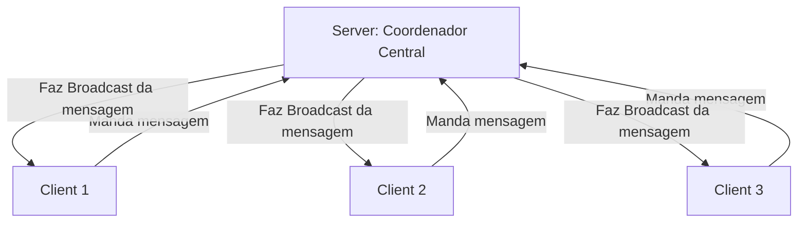

# Diagrama em Mermaid

```mermaid 
graph TD
    Server[Server: Coordenador Central]
    Client1[Client 1]
    Client2[Client 2]
    Client3[Client 3]

    %% Connections
    Client1 -->|Manda mensagem| Server
    Client2 -->|Manda mensagem| Server
    Client3 -->|Manda mensagem| Server

    Server -->|Faz Broadcast da mensagem| Client1
    Server -->|Faz Broadcast da mensagem| Client2
    Server -->|Faz Broadcast da mensagem| Client3
```